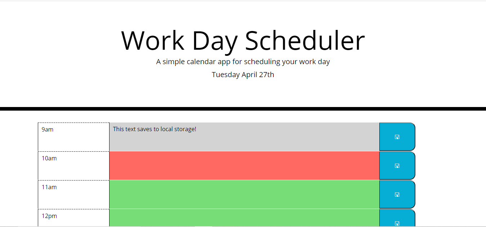
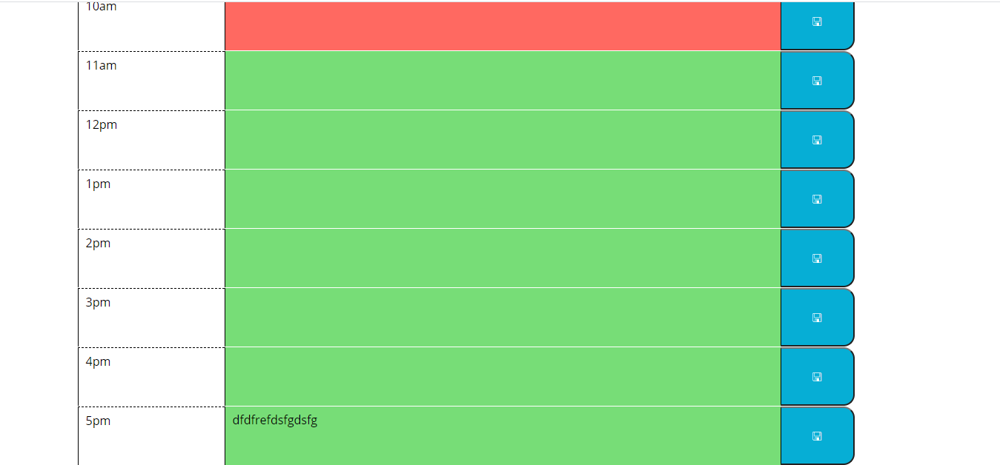

# Work Day Scheduler- Keep your day organized! 

## About

This application helps you organize your work day. Type into the text boxes and click the save icon and the text is saved. The colors change depending on the hour, and the current date is given at the top. 

## Screenshots

Screenshot #1:

Screenshot #2:

## Links

- Live deploy of main on GitHub Pages:  https://rorylkd.github.io/WorkDayScheduler/

## Technology Used

-HTML
-Javascript
-CSS
-Moment.js
-Bootstrap
-Google Fonts
